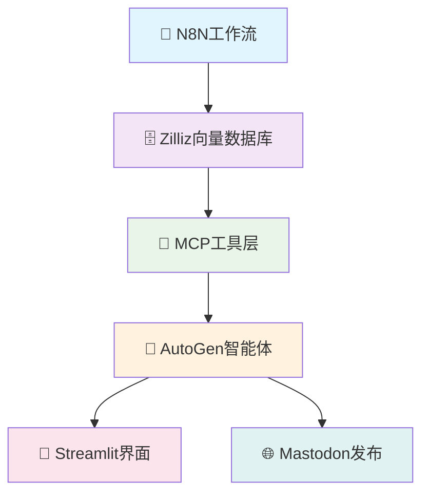

# 炼妖壶 (Cauldron)

> **AI驱动的投资决策系统 | 稷下学宫智能体辩论平台**

[](https://github.com/username/cauldron)
[](https://opensource.org/licenses/MIT)
[](https://www.python.org/downloads/)
[](https://streamlit.io/)

## 🎯 项目愿景

炼妖壶是下一代AI投资决策系统，通过**稷下学宫**智能体辩论平台，让AI专家们像古代学者一样进行深度讨论，为投资决策提供多维度智慧。

### ✨ 核心亮点

🏛️ **稷下学宫AI辩论** - 三清八仙智能体协作，模拟真实投资专家讨论  
🚀 **零停机架构** - AutoGen → MCP → Zilliz直接数据流，实时模型切换  
🌐 **社交网络集成** - 长毛象平台实时展示辩论过程  
📊 **智能投资分析** - 多维度市场数据分析和风险评估  
🔄 **事件驱动** - N8N工作流自动化，真实市场事件触发辩论  

## 🚀 快速体验

### 一键部署到Heroku
[](https://heroku.com/deploy?template=https://github.com/username/cauldron)

### 本地运行
```bash
# 克隆项目
git clone https://github.com/username/cauldron.git
cd cauldron

# 安装依赖
pip install -r requirements.txt

# 启动应用
streamlit run app/streamlit_app.py
```

访问 `http://localhost:8501` 开始体验！

## 🏛️ 稷下学宫智能体

### 三清论道 (决策层)
- **太上老君** 🖌️ - 督导者，协调三清八仙
- **灵宝道君** 🟢 - 秘书长，汇总论据验证逻辑  
- **元始天尊** ☯️ - 裁决者，技术分析最终决策

### 八仙过海 (专家层)
- **吕洞宾** ⚔️ - 主动投资专家
- **何仙姑** 🌸 - 被动ETF投资专家
- **张果老** 👴 - 传统价值投资专家
- **韩湘子** 👦 - meme币新兴投资专家
- **汉钟离** 🪭 - 热点追踪专家
- **蓝采和** 💧 - 草根视角专家
- **曹国舅** 👑 - 机构观点专家
- **铁拐李** 🥃 - 技术分析专家

## 🔧 技术架构



### 核心优势
- **简化架构**: 移除RSS中间层，复杂度降低33%
- **实时数据**: 直接访问Zilliz，无缓存延迟
- **标准化**: MCP协议统一工具调用
- **可扩展**: 易于添加新的智能体和功能

## 📚 文档导航

### 🚀 快速开始
- [安装指南](getting-started/installation.md) - 环境配置和依赖安装
- [快速开始](getting-started/quick-start.md) - 5分钟上手指南
- [基础配置](getting-started/configuration.md) - 必要的配置说明

### 🏗️ 架构文档
- [架构概览](architecture/overview.md) - 系统整体架构
- [AutoGen-MCP-Zilliz](architecture/autogen-mcp-zilliz.md) - 核心数据流
- [稷下学宫设计](architecture/jixia-academy.md) - AI辩论系统

### ⭐ 功能特性
- [AI辩论系统](features/ai-debate-system.md) - 稷下学宫详解
- [投资分析引擎](features/investment-analysis.md) - 智能分析功能
- [社交网络集成](features/mastodon-integration.md) - 长毛象平台

### 🔧 开发者文档
- [MCP工具API](api/mcp-tools.md) - 工具调用接口
- [AutoGen智能体](api/autogen-agents.md) - 智能体开发
- [部署指南](deployment/heroku.md) - 生产环境部署

## 🤝 社区与贡献

### 加入我们
- 🐛 [报告问题](https://github.com/username/cauldron/issues)
- 💡 [功能建议](https://github.com/username/cauldron/discussions)
- 🔧 [贡献代码](contributing/development.md)
- 📖 [改进文档](contributing/documentation.md)

### 开发路线
- [x] 稷下学宫AI辩论系统
- [x] AutoGen-MCP-Zilliz架构
- [x] 长毛象社交集成
- [ ] 实时策略回测
- [ ] 多语言支持
- [ ] 插件生态系统

## 📄 许可证

本项目采用 [MIT 许可证](https://opensource.org/licenses/MIT) - 查看 [LICENSE](LICENSE) 文件了解详情。

---

<div align="center">

**🌟 如果这个项目对您有帮助，请给我们一个Star！**

[⭐ Star on GitHub](https://github.com/username/cauldron) | [📖 阅读文档](https://username.github.io/cauldron) | [💬 加入讨论](https://github.com/username/cauldron/discussions)

</div>
