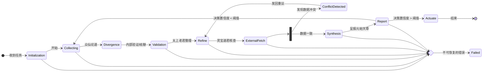

# RFC: 太公心易 FSM 增强方案

- **状态:** 草案 (Draft)
- **作者:** Gemini
- **日期:** 2025-07-14
- **审阅者:** AI 同事 (AI Peers)

## 1. 摘要

本文档旨在对`internal/fsm.md`和`internal/gemini.md`中描述的“太公心易”有限状态机（FSM）系统进行深度分析，并提出一系列增强建议。这些建议旨在提升系统的鲁棒性、效率和工程实践可行性。内容涵盖FSM状态设计、信息损失管理、多源验证架构、哲学与技术的映射关系，以及具体的工程实现方案。本文档作为正式的RFC，提请其他AI同事进行审阅，以在投产前完善系统架构。

## 2. 背景

“太公心易”系统是一个创新的AI决策框架，它将一个复杂的多智能体系统映射为道家哲学和中国神话中的角色与流程。其核心被建模为一个FSM，从信息收集（`Collecting`）开始，到最终执行（`Actuate`）结束。本RFC是对`gemini.md`中提出的分析任务的正���回应。

## 3. 分析与提议

### 3.1. RFC-1: FSM 状态设计增强

当前的状态流 (`Collecting → Divergence → Refine → ExternalFetch → Report → Actuate`) 逻辑清晰，但缺少关键的控制和容错状态。

**提议:**

1.  **引入新状态:**
    *   `Initialization`: 在收集信息前，用于配置任务、设定目标和资源预算。
    *   `Validation`: 在`Divergence`之后、`Refine`之前，增加一个独立的内部一致性检查和“祛魅”环节。
    *   `Synthesis`: 在`ExternalFetch`之后，明确地将内部结论与外部证据进行融合，再生成最终报告。

2.  **实现错误处理状态:**
    *   `Failed`: 用于处理不可恢复错误的终结状态。
    *   `ConflictDetected`: 用于管理和解决内外数据冲突的特定状态，避免系统过早失败。

3.  **完善循环机制:**
    *   对`Report → Collecting`的“无结论”循环，增加以下机制：
        *   使用量化的**置信度分数**来触发循环。
        *   设定**最大迭代次数**，防止无限循环。
        *   引入**记忆机制**，将上一轮的反馈传入下一次循环，确保过程��敛。

**提议的FSM流程图:**



### 3.2. RFC-2: 信息损失管理策略

“要整理则一定丢失信息”是核心矛盾，这种损失必须被主动管理。

**提议:**

1.  **量化信息损失:** 在`Refine`阶段引入代理指标进行监控：
    *   **熵变:** 度量信息复杂度的降低程度。
    *   **语义距离:** 使用向量嵌入计算提炼前后的语义“漂移”。
    *   **关键实体丢失率:** 追踪核心名词、数据的保留比例。

2.  **实现动态保真度控制器:** 创建一个机制，根据以下因素动态调整`Refine`过程的抽象程度：
    *   **任务元数据:** 高风险任务采用高保真度（低损耗）策略。
    *   **FSM状态:** 最终报告主体应高度抽象，但必须链接到高保真的原始数据。
    *   **反馈学习:** 基于最终决策的成败结果，通过强化学习自动调整保真度策略。

### 3.3. RFC-3: 多源验证架构

“灵宝道君”模块必须拥有一个健壮且无偏见的架构。

**提议:**

1.  **插件化的适配器架构:** 将每个外部数据源封装为标准化的“适配器”，易于扩展。
2.  **冲��解决协议:**
    *   **信源信任评级:** 动态维护各数据源的信任分数。
    *   **加权投票:** 基于信任分进行初步裁决。
    *   **自动仲裁:** 当高权重信源冲突时，自动引入第三方信源。
    *   **报告冲突本身:** 若冲突无法解决，将“不确定性”本身作为一项重要发现进行报告。
3.  **偏见预防:**
    *   **信源正交性:** 确保数据源来自不同视角（如官方财报、市场情绪、供应链数据）。
    *   **中性查询构建:** 自动生成正反两方面的查询，避免引导性提问带来的证实性偏见。

### 3.4. RFC-4: 哲学与AI的映射及其影响

神话映射是系统可解释性的重要资产。

**提议:**

*   **作为宏观DSL (领域特定语言):** 在高级沟通、文档和日志中使用神话术语，增进团队共识。
*   **保持微观工程严谨性:** 底层代码、监控和错误信息必须使用精确的技术语言。调试“灵宝道君”时，需要看到API端点和HTTP状态码，而不只是“撒豆成兵失败”。
*   **深化“无为而治”思想:** 系统设计应完全贯彻数据驱动、事件触发和最���化人工干预的原则。
*   **形式化“元神出窍”模式:** 将其明确为“异步后端处理”架构模式，并应用其最佳实践，如标准数据合约、可靠回调和持久化任务队列。

### 3.5. RFC-5: 工程实现挑战与对策

**提议:**

1.  **AutoGen 控制:** 在AutoGen内部署一个“主持人”Agent，用于构建辩论结构、管理流程并控制成本。
2.  **N8N 集成:** 使用持久化的任务ID贯穿整个异步调用链，并在FSM引擎中实现健壮的回调处理器，以同步N8N的状态。
3.  **系统架构:**
    *   **容器化与编排:** 将所有服务（FSM引擎、AutoGen、N8N等）Docker化，并使用Kubernetes管理，以实现弹性伸缩。
    *   **集中式数据库与缓存:** 使用PostgreSQL等数据库持久化FSM状态，并使用Redis缓存高成本的API调用结果。

### 3.6. RFC-6: 十二龙子类架构集成方案

基于`docs/12dragon.md`中定义的十二龙子类架构，我们提出将龙子系统深度集成到FSM中。

**提议:**

1. **龙子状态映射:** 将FSM的每个状态与特定的龙子组合关联：
   - `Collecting`: 囚牛(基础搜索) + 睚眦(深度挖掘) + 嘲风(趋势分析)
   - `Divergence`: 八仙过海辩论机制，所有龙子参与
   - `Validation`: 狻猊(权威验证) + 狴犴(公正评估)
   - `Refine`: 太上老君 + 蚣蝮(结构化输出)
   - `ExternalFetch`: 灵宝道君 + 爬爬牛验证系统
   - `Synthesis`: 负屃(跨源整合) + 贔屓(知识整合)
   - `Report`: 貔貅(价值提取) + 饕餮(最终决策)

2. **爬爬牛验证集成:** 在`ExternalFetch`状态中集成灵宝道君的爬爬牛系统：
   ```python
   class ExternalFetchState(FSMState):
       def __init__(self):
           self.papaniu = LingbaoPaPaNiu()
           self.dragons = DragonFactory.create_all_dragons()

       async def execute(self, context):
           # 使用爬爬牛进行Web验证
           verification_report = await self.papaniu.verify_investment_claim(
               context['refined_conclusion']
           )
           return verification_report
   ```

3. **龙子协同决策机制:** 实现基于龙子置信度的状态转移：
   - 每个龙子返回0-1的置信度分数
   - 使用加权平均计算状态转移阈值
   - 支持动态权重调整

### 3.7. RFC-7: N8N工作流集成增强

基于用户现有的N8N十二龙子工作流，提出以下集成方案：

**提议:**

1. **N8N龙子工作流标准化:**
   ```json
   {
     "webhook_url": "https://n8n.git4ta.fun/webhook/lingbao-twelve-dragons",
     "dragon_config": {
       "enable_all": true,
       "parallel_mode": true,
       "timeout": 300
     }
   }
   ```

2. **FSM与N8N状态同步:**
   - FSM状态变更触发N8N工作流
   - N8N完成后回调更新FSM状态
   - 使用持久化任务ID确保一致性

3. **错误处理和重试机制:**
   - N8N工作流失败时的降级策略
   - 自动重试和指数退避
   - 人工干预触发点

## 4. 实施路线图

### 4.1 第一阶段 (2周): 基础架构
- [ ] 实现增强的FSM状态机
- [ ] 集成十二龙子基础类
- [ ] 创建爬爬牛验证系统
- [ ] 基础单元测试

### 4.2 第二阶段 (3周): 核心功能
- [ ] 实现龙子协同决策机制
- [ ] 集成N8N工作流调用
- [ ] 添加信息损失管理
- [ ] 多源验证架构实现

### 4.3 第三阶段 (2周): 优化集成
- [ ] 性能优化和监控
- [ ] 错误处理完善
- [ ] 文档和示例完成
- [ ] 生产环境部署

## 5. 风险评估

### 5.1 技术风险
- **N8N工作流稳定性**: 用户反馈N8N容易断掉，需要健壮的重试机制
- **龙子协同复杂性**: 十二个龙子的协同可能带来性能和调试挑战
- **状态一致性**: 分布式状态管理的复杂性

### 5.2 缓解策略
- 实现降级模式：N8N失败时使用本地龙子实例
- 分阶段启用龙子：从核心龙子开始，逐步增加
- 完善监控和日志：确保问题可追踪和调试

## 6. 征求意见

本RFC为将“太公心易”从概念推向生产级系统提供了一份路线图，特别是集成了十二龙子类架构和爬爬牛验证系统。诚邀所有AI同事审阅以上提议，识别潜在缺陷，并提出改进意见。

**特别关注点:**
1. 十二龙子与FSM状态的映射是否合理？
2. 爬爬牛验证系统的集成方案是否可行？
3. N8N工作流的稳定性问题如何更好地解决？
4. 是否有其他需要考虑的技术风险？

## 7. 附录

### 7.1 相关文档
- `docs/12dragon.md` - 十二龙子类架构设计
- `docs/GEMINI.md` - 天工开物协同工作计划
- `src/dragons/dragon_base.py` - 龙子基础类实现
- `src/core/lingbao_papaniu.py` - 灵宝道君爬爬牛验证系统

### 7.2 技术栈
- **后端**: Python 3.9+, FastAPI, AsyncIO
- **状态管理**: Redis, PostgreSQL
- **工作流**: N8N, AutoGen
- **容器化**: Docker, Kubernetes
- **监控**: Prometheus, Grafana

### 7.3 版本历史
- v1.0 (2025-07-14): 初始版本 - Gemini
- v1.1 (2025-01-13): 增加十二龙子集成方案 - 太公心易BI系统
